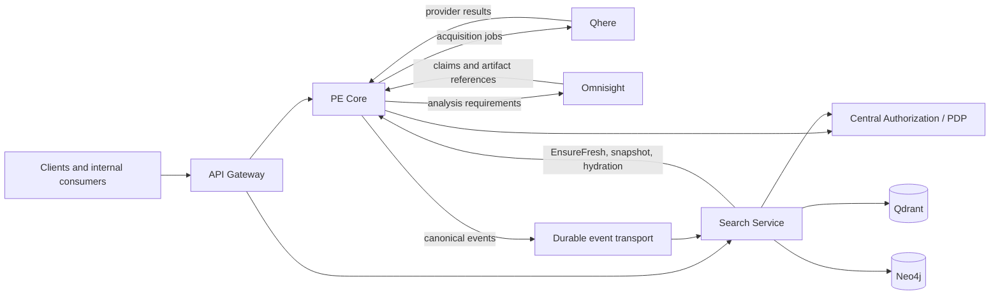
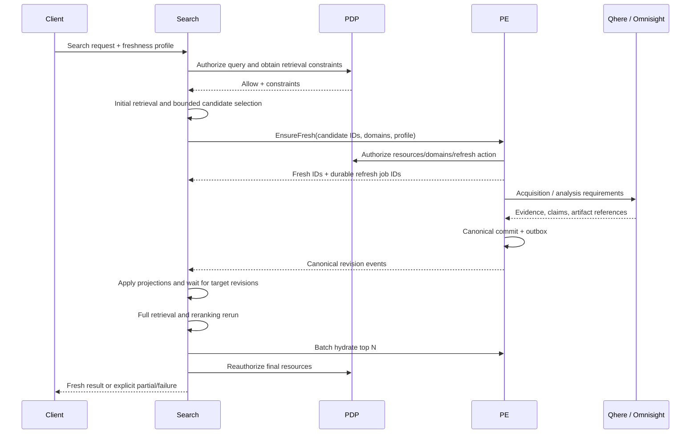

# Perception Enrichment (PE)

## Product Requirements Document — Revised Service Boundaries

**Version:** 0.5  
**Status:** Draft for product and architecture review  
**Date:** August 12, 2026  
**Document scope:** PE Core and its required contracts with Search, Qhere, Omnisight, API Gateway, and Central Authorization/PDP  
**Reviewers:** Product, PE, Search, Omnisight, Qhere, Platform, Security, Data Governance

> **Decision summary.** PE is the system of record for provenance-backed creator knowledge. Search is a separate, rebuildable retrieval system. Qhere performs external acquisition. Omnisight performs media and ML analysis. The API Gateway provides the shared API edge, while a Central Authorization service/PDP owns access policies. Search may initiate a bounded data-refresh workflow through PE, wait for canonical and projection readiness, and then rerun the search.

---

## 1. Purpose and document status

This PRD defines the revised product boundary and release requirements for Perception Enrichment. It narrows PE from a broad creator-intelligence and search platform into a coherent canonical knowledge system, while defining the contracts needed to separate Search from Omnisight in a later phase.

This version is intended to support product approval and Gate A investigation. It is normative about ownership, behavior, consistency, security, and user-visible outcomes. It intentionally does not select every infrastructure product or freeze detailed wire schemas. Those choices belong in Gate A deliverables and Architecture Decision Records (ADRs).

### 1.1 What changed in this revision

The following architectural decisions are introduced or made explicit:

1. PE owns acquisition requirements, immutable provider evidence, normalization, claims, identity resolution, canonicalization, provenance, revisions, and canonical freshness decisions.
2. Search becomes a separate system that owns vector and lexical indexing, graph projection, hybrid retrieval, reranking, search-specific indexes, and Qdrant/Neo4j operations.
3. PE never writes directly to Qdrant or Neo4j. Search consumes revisioned canonical changes and can rebuild its state from PE.
4. Qhere and Omnisight are called through durable asynchronous jobs. PE specifies the required result; each service owns execution inside its boundary.
5. The API Gateway and Central Authorization/PDP are platform capabilities shared across services. Gateway ownership is subject to an adopt-before-build evaluation.
6. Search may request PE to refresh a bounded, authorized candidate cohort, wait for both canonical and search-projection readiness, then rerun retrieval and ranking.
7. `canonical ready`, `analysis ready`, and `searchable ready` are distinct states with distinct owners.

### 1.2 Requirement language

The keywords **MUST**, **MUST NOT**, **SHOULD**, **SHOULD NOT**, and **MAY** describe requirement strength. Priorities use:

- **P0:** required for the applicable production phase;
- **P1:** required shortly after the first production release or before migration completion;
- **P2:** valuable follow-up work.

---

## 2. Executive summary

Halo needs a reliable representation of creators assembled from multiple providers and internal analyses. Provider responses can conflict, arrive late, describe the same person through different accounts, and become stale at different rates. Search indexes and ML artifacts can lag behind the canonical state. Access rights can vary by tenant, resource, and data class.

PE solves the knowledge problem. It stores immutable evidence, derives normalized claims, resolves identity, selects the currently preferred claim through versioned rules, tracks freshness, and publishes canonical revisions. PE does not claim to discover objective truth; it maintains an auditable, reversible, provenance-backed canonical representation.

Search solves the retrieval problem. It projects PE state into Qdrant, Neo4j, and other search-specific indexes; executes hybrid retrieval and reranking; and returns ranked candidates. It is fully derived and rebuildable. When a search requires fresher data, Search owns the durable end-to-end search workflow but asks PE to evaluate and perform the refresh. Search waits for the requested canonical revisions and its corresponding projection revisions, then reruns the query.

This separation enables the team to implement PE Core first while leaving current search capabilities in Omnisight temporarily. The future PE-to-Search contract is established before PE implementation, so Search can later be extracted without redesigning PE or creating a second source of truth.

---

## 3. Product problem

### 3.1 Current problems

Creator knowledge is currently fragmented across external providers, internal analysis pipelines, operational databases, and search stores. The system needs to handle:

- conflicting values for the same fact;
- multiple platform accounts belonging to one person or organization;
- evidence collected at different times and with different reliability;
- internal analyses tied to specific media/input revisions;
- partial provider responses and long-running enrichment;
- stale or missing search projections;
- merges, splits, deletions, and access revocations;
- tenant- and data-class-specific authorization;
- migrations without losing provenance or silently changing meaning.

A broad PE implementation that also owns retrieval, Qdrant, Neo4j, graph traversal, ranking, and all access policy would create an oversized runtime boundary and make phased delivery harder. Conversely, splitting canonicalization across services would create incompatible truths and distributed consistency failures.

### 3.2 Product opportunity

The revised architecture creates a stable knowledge contract:

```text
external evidence + internal analysis
                 ↓
       provenance-backed claims
                 ↓
 identity resolution + survivorship rules
                 ↓
 versioned canonical creator knowledge
                 ↓
       rebuildable serving projections
```

This contract allows acquisition, analysis, authorization, and search to evolve independently while retaining one authority for creator knowledge.

---

## 4. Product principles

1. **Evidence before assertion.** Every canonical fact MUST be traceable to evidence, a rule version, or an audited manual decision.
2. **Preserve disagreement.** Selecting a canonical claim MUST NOT delete conflicting claims or source payloads.
3. **One canonical owner.** PE is the only service that changes canonical creator knowledge.
4. **Derived systems are disposable.** Search indexes and caches MUST be recoverable from PE snapshots plus subsequent events.
5. **Requirements, not execution details.** PE tells Qhere or Omnisight what result is required; those services decide how to execute it.
6. **Freshness is domain- and revision-aware.** A successful job is not, by itself, proof that data is fresh.
7. **Authorization shapes work and retrieval.** Restricted resources MUST NOT influence unauthorized search results, snippets, scores, refresh spend, or final output.
8. **Durable workflows for long work.** Client disconnects and interactive deadlines MUST NOT corrupt or silently abandon accepted work.
9. **Bounded interactive enrichment.** A search may refresh selected candidates, but it MUST NOT imply that the entire corpus has been refreshed.
10. **Adopt infrastructure before rebuilding it.** Standard Gateway capabilities should be acquired or configured before custom implementation is considered.

---

## 5. Goals and non-goals

### 5.1 Goals

**G1 — Canonical knowledge.** Maintain a versioned, provenance-backed canonical representation of creators, accounts, content, organizations, contacts, and relationships.

**G2 — Reliable evidence lifecycle.** Acquire provider data through Qhere, store immutable raw evidence, normalize it into claims, and retain sufficient lineage for replay and audit.

**G3 — Identity and survivorship.** Resolve identities and select preferred facts through versioned, field-aware rules without erasing competing evidence.

**G4 — Freshness orchestration.** Evaluate domain-specific freshness, deduplicate refresh requests, and obtain required provider or Omnisight outputs through durable asynchronous jobs.

**G5 — Stable Search contract.** Publish revisioned canonical changes and expose snapshot, incremental backfill, batch hydration, and freshness APIs required by a separate Search Service.

**G6 — Secure multi-service access.** Integrate with a common Gateway and PDP while keeping data classification in PE and policy ownership in the authorization service.

**G7 — Phased migration.** Deliver PE Core before extracting Search from Omnisight, with shadow testing, parity gates, rollback, and no dual ownership of canonical truth.

### 5.2 Non-goals for PE Core

PE Core does not own:

- vector, lexical, or hybrid retrieval;
- reranking or query planning;
- graph traversal or graph-based candidate generation;
- Qdrant or Neo4j operation;
- search-specific embedding/index schemas;
- direct provider scraping or provider routing inside Qhere;
- Omnisight model selection, GPU scheduling, batching, or worker retries;
- authentication, token issuance, or user-directory functionality;
- central grants, policy rules, or revocation ownership;
- an exactly-once event-delivery guarantee;
- an exhaustive, corpus-wide fresh search performed interactively;
- long-running refresh inside a single mandatory synchronous HTTP connection;
- a custom API Gateway before the adopt-before-build evaluation is complete.

### 5.3 Program scope versus PE release scope

This PRD defines PE Core and the contracts that neighboring systems MUST satisfy. It does not require PE Core, the new Search Service, the Gateway platform, and the PDP platform to be delivered as one release.

- **Phase 1 delivery scope:** PE Core, Qhere/Omnisight integrations, canonical APIs, outbox/events, and future Search contracts.
- **Phase 2 delivery scope:** new Search Service, backfill, shadow mode, and migration from Omnisight Search.
- **Platform workstreams:** Gateway and Central Authorization/PDP, required before applicable production exposure and Search cutover.

---

## 6. Definitions

| Term | Definition |
|---|---|
| Evidence | Immutable source payload or artifact plus source, collection time, checksum, and acquisition metadata. |
| Claim | A normalized assertion derived from evidence or an internal analysis. Conflicting claims may coexist. |
| Canonical representation | The currently preferred, versioned view selected from claims through rules and audited decisions. It is not a claim of objective truth. |
| Identity link | A versioned assertion that accounts, content, people, or organizations represent the same or related real-world entity. |
| Survivorship | Field- and domain-specific rules that select the preferred claim and compose account facts into a creator view. |
| Freshness profile | A versioned product policy defining required domains, maximum ages, analyses, deadlines, and budget limits for a use case. |
| Canonical revision | A monotonically increasing revision of an entity's canonical state. |
| Input revision | The exact PE input state against which an Omnisight analysis is requested and produced. |
| Projection revision | The latest canonical revision applied by Search for an entity or projection partition. |
| Watermark | A global cursor representing the ordered boundary of a snapshot or incremental change stream. |
| Hydration | Fetching current canonical facts from PE for IDs selected by Search. |
| PDP | Policy Decision Point: the central service that decides whether a subject may perform an action on a resource/data class. |
| Canonical ready | PE has committed the required canonical state. |
| Analysis ready | Required Omnisight outputs for the requested input revision are available to PE. |
| Searchable ready | Search has applied the required canonical revision to all projections required by the query. |

---

## 7. System boundaries and ownership

### 7.1 Target system context



### 7.2 Responsibility matrix

| Capability | Owner | Key boundary |
|---|---|---|
| Provider acquisition requirement | PE | PE determines what data/domain is needed and why. |
| Provider execution and routing | Qhere | Qhere selects/executes providers according to the submitted constraints. |
| Raw provider payloads/evidence | PE | Stored immutably with checksum, provenance, and retention metadata. |
| Normalization and claims | PE | Source-specific payloads become typed claims. |
| Identity resolution | PE | Includes account-to-creator identity and merge/split decisions. |
| Canonical relationships | PE | Search only projects them into graph form. |
| Survivorship/canonicalization | PE | Versioned rules and audited overrides select the current representation. |
| Canonical freshness | PE | Evaluated per resource, domain, evidence, and profile version. |
| Media/ML analysis execution | Omnisight | Models, compute, queues, batching, and internal retries remain private. |
| Analysis requirement | PE | PE specifies resource, input revision, and analysis profile. |
| Vector/lexical indexes | Search | Includes schema, lifecycle, backfill, and rebuild. |
| Graph projection | Search | Neo4j is a projection of canonical PE relationships. |
| Retrieval and reranking | Search | Includes query planning, fusion, ranking, explanations, and search SLOs. |
| Qdrant/Neo4j operation | Search | PE never writes directly to these stores. |
| Search-dependent refresh workflow | Search | Search owns the durable user workflow; PE owns refresh evaluation/execution. |
| Authentication and API edge | Gateway | Token validation, routing, quotas, coarse scopes, and API versioning. |
| Policies, grants, revocations | Central Authorization/PDP | Services remain policy enforcement points. |
| Data classification/provenance labels | PE | PDP consumes labels to decide access. |

### 7.3 Ownership invariants

- PE MUST be the only writer of canonical creator state.
- Search MUST NOT infer a new canonical fact from ranking, graph structure, or index content.
- Search MUST NOT write facts or identity decisions back into PE except through an explicit feedback/review API that creates evidence or a review task; such an API is P2 and not part of release 1.
- Qhere and Omnisight results MUST enter PE as evidence/claims tied to an exact job and input context.
- Gateway MUST NOT contain domain canonicalization, refresh orchestration, search ranking, or authorization policy definitions.
- PDP MUST NOT become an authentication provider, user directory, canonical data store, or search service.

---

## 8. Primary product use cases

### UC1 — Read current canonical creator data

A permitted client requests a creator or account. PE returns the current canonical representation, freshness metadata, canonical revision, provenance/citations permitted for the caller, and any partial/unavailable domain status.

### UC2 — Explicitly refresh creator data

A permitted client or internal workflow requests a versioned freshness profile for a known resource. PE evaluates current state, deduplicates overlapping work, invokes Qhere and/or Omnisight only where required, commits a new canonical revision if the preferred representation changes, and exposes durable job status.

### UC3 — Search with available data

Search authorizes the request, retrieves from current projections, reranks, batch-hydrates top candidates from PE, performs final authorization, and returns results with freshness and revision metadata. No refresh job is created when the requested profile is already satisfied or the request uses `available` mode.

### UC4 — Search requiring fresh data

Search performs an initial retrieval, selects a bounded and authorized candidate cohort, asks PE to ensure the requested freshness, waits for canonical revisions and its own projection revisions, reruns full retrieval and ranking, hydrates and reauthorizes the final candidates, then returns the result. If the interactive deadline expires, the durable search job continues asynchronously.

### UC5 — Rebuild Search after data loss or schema change

Search obtains an authorization-appropriate canonical snapshot from PE at a declared watermark, builds projections, consumes changes after the watermark, verifies completeness, and advances its readiness watermark without asking PE to reconstruct index-specific data manually.

### UC6 — Correct identity through merge or split

PE records an audited, versioned identity decision, recomputes affected canonical representations, publishes merge/split and tombstone semantics, and allows Search to remove or remap obsolete entities without granting access to unintended successors.

---

## 9. PE Core functional requirements

### 9.1 Acquisition planning and Qhere integration

| ID | Priority | Requirement |
|---|---:|---|
| PE-ACQ-001 | P0 | PE MUST determine required resources, data domains, freshness profile, and provider constraints before submitting a Qhere job. |
| PE-ACQ-002 | P0 | Provider acquisition MUST be durable and asynchronous; a caller connection MUST NOT be the durability boundary. |
| PE-ACQ-003 | P0 | Every request MUST carry a PE job ID, idempotency key, correlation/trace ID, deadline, and requested domain list. |
| PE-ACQ-004 | P0 | PE MUST deduplicate compatible concurrent requests for the same resource/domain/profile while preserving each requester's status. |
| PE-ACQ-005 | P0 | Qhere callbacks/results MUST be authenticated, replay-protected, and idempotently processed. |
| PE-ACQ-006 | P0 | PE MUST distinguish retryable provider failure, terminal failure, unsupported domain, throttling, timeout, and partial success. |
| PE-ACQ-007 | P1 | Provider selection constraints SHOULD support `auto`, `preferred-with-fallback`, and `required-provider` semantics when Qhere supports them. |

### 9.2 Raw evidence and artifact storage

| ID | Priority | Requirement |
|---|---:|---|
| PE-EVD-001 | P0 | Provider payloads MUST be stored immutably or content-addressed before canonicalization completes. |
| PE-EVD-002 | P0 | Evidence MUST include source/provider, collection time, observation time when available, receipt time, checksum, schema/adapter version, job ID, tenant/visibility classification, and retention policy. |
| PE-EVD-003 | P0 | Reprocessing the same payload MUST NOT create duplicate evidence, claims, jobs, or canonical revisions. |
| PE-EVD-004 | P0 | Corrections MUST create new claims/evidence or an audited supersession record; raw source material MUST NOT be silently edited. |
| PE-EVD-005 | P0 | PE MUST retain enough lineage to explain which evidence and rule version produced every canonical field. |
| PE-EVD-006 | P0 | PE MUST store references, hashes, profiles, and extracted claims for Omnisight artifacts. Physical ownership of original media and derived blobs follows Section 18. |

### 9.3 Normalization and claims

| ID | Priority | Requirement |
|---|---:|---|
| PE-CLM-001 | P0 | Provider-specific payloads MUST be transformed into typed, versioned claims through replayable normalization logic. |
| PE-CLM-002 | P0 | A claim MUST identify subject, predicate/domain, value, source evidence, observation time, confidence when applicable, normalization version, and visibility/data class. |
| PE-CLM-003 | P0 | Conflicting claims MUST coexist and remain queryable for audit. |
| PE-CLM-004 | P0 | Normalizer changes MUST be replayable against retained evidence without requiring provider reacquisition. |
| PE-CLM-005 | P1 | The system SHOULD support quarantine and operator review for payloads that fail validation or produce ambiguous claims. |

### 9.4 Identity resolution

| ID | Priority | Requirement |
|---|---:|---|
| PE-ID-001 | P0 | PE MUST maintain stable canonical IDs independent of provider-specific IDs. |
| PE-ID-002 | P0 | Identity resolution MUST produce versioned links with evidence, confidence, model/rule version, and audit history. |
| PE-ID-003 | P0 | Merge and split operations MUST be reversible through compensating revisions and MUST preserve historical IDs and lineage. |
| PE-ID-004 | P0 | A split MUST NOT automatically copy access grants to every successor. Grant reassignment MUST be evaluated against the account/evidence scope and current policy. |
| PE-ID-005 | P0 | Identity decisions MUST be concurrency-safe and idempotent. |
| PE-ID-006 | P1 | Low-confidence or high-impact merge/split decisions SHOULD support manual review and audited override. |

### 9.5 Survivorship and canonical composition

PE maintains a two-stage composition model where applicable:

1. select preferred provider claims for an account/resource and domain;
2. compose account-level results into a canonical creator representation.

| ID | Priority | Requirement |
|---|---:|---|
| PE-CAN-001 | P0 | Survivorship rules MUST be versioned and field/domain-specific; “latest always wins” MUST NOT be the universal rule. |
| PE-CAN-002 | P0 | Each canonical field MUST expose its winning claim/evidence reference and selection-rule version to authorized auditors. |
| PE-CAN-003 | P0 | A canonical update MUST be committed atomically with a monotonically increasing entity revision and an outbox record. |
| PE-CAN-004 | P0 | A new claim that does not change the preferred canonical representation MUST remain recorded without creating a misleading semantic change event. |
| PE-CAN-005 | P0 | Manual overrides MUST be explicit, scoped, expirable where appropriate, and fully audited. |
| PE-CAN-006 | P0 | PE MUST represent unresolved conflict or unknown state rather than fabricate a preferred value when no rule can decide safely. |

### 9.6 Freshness evaluation and refresh orchestration

| ID | Priority | Requirement |
|---|---:|---|
| PE-FR-001 | P0 | Freshness MUST be evaluated by versioned profile, resource, data domain, observation/collection time, required analysis, and relevant input revision. |
| PE-FR-002 | P0 | PE MUST expose `already_fresh`, `refresh_required`, `refresh_in_progress`, `partially_fresh`, `unsupported`, `unavailable`, and `terminal_failure` outcomes. |
| PE-FR-003 | P0 | PE MUST coalesce compatible refresh obligations and prevent duplicate provider/analysis spend. |
| PE-FR-004 | P0 | Refresh completion MUST refer to explicit domains and revisions; “job succeeded” MUST NOT imply all data is fresh. |
| PE-FR-005 | P0 | A late Qhere or Omnisight result MUST NOT regress a newer canonical revision. It MAY be retained as historical evidence. |
| PE-FR-006 | P0 | PE MUST enforce deadline, quota, authorization, and cost constraints supplied by the approved freshness profile and caller context. |
| PE-FR-007 | P0 | If refresh completes but the profile remains unsatisfied, PE MUST return an explicit unsatisfied/partial outcome and reason. |
| PE-FR-008 | P1 | Freshness profiles SHOULD be centrally versioned and named by use case rather than embedding mutable per-field rules in Search clients. |

### 9.7 Omnisight analysis requirements

| ID | Priority | Requirement |
|---|---:|---|
| PE-OMNI-001 | P0 | PE MUST request an analysis using resource ID, immutable input/artifact reference, exact input revision, versioned analysis profile, deadline, and idempotency key. |
| PE-OMNI-002 | P0 | Omnisight owns model selection, execution queues, GPU/worker scheduling, batching, retries, and private processing indexes. |
| PE-OMNI-003 | P0 | PE MUST validate returned input revision, profile/model version, artifact checksum/reference, claims, and per-domain completion status. |
| PE-OMNI-004 | P0 | An analysis for an obsolete input revision MUST NOT overwrite current canonical state. |
| PE-OMNI-005 | P0 | PE MUST record execution provenance sufficient to reproduce or explain the analysis contract, without requiring visibility into Omnisight internals. |
| PE-OMNI-006 | P1 | PE SHOULD support reanalysis when a freshness profile changes, a model/profile is invalidated, or source media revision changes. |

### 9.8 Canonical read and hydration APIs

| ID | Priority | Requirement |
|---|---:|---|
| PE-API-001 | P0 | PE MUST expose current canonical state by stable resource ID with canonical revision, domain freshness, and authorized provenance references. |
| PE-API-002 | P0 | PE MUST support batch hydration for bounded lists of IDs selected by Search. |
| PE-API-003 | P0 | Batch responses MUST preserve per-resource authorization and status; one denied or missing resource MUST NOT corrupt the whole batch. |
| PE-API-004 | P0 | Reads MUST allow callers to request a minimum canonical revision or receive an explicit not-ready/timeout outcome. |
| PE-API-005 | P1 | Authorized audit clients SHOULD be able to inspect competing claims and the canonical selection rationale. |

### 9.9 Canonical change publication

| ID | Priority | Requirement |
|---|---:|---|
| PE-EVT-001 | P0 | Canonical changes MUST create an outbox record in the same database transaction as the canonical commit. |
| PE-EVT-002 | P0 | Event delivery semantics MUST assume at-least-once delivery; consumers MUST be idempotent and revision-guarded. |
| PE-EVT-003 | P0 | Events MUST include event ID, event type, entity ID, canonical revision, schema version, correlation ID, occurrence time, changed fields or snapshot reference, and policy/data-class metadata sufficient for projection. |
| PE-EVT-004 | P0 | PE MUST publish explicit semantics for delete, relationship change, merge, split, and visibility-metadata change. |
| PE-EVT-005 | P0 | Event transport MUST NOT be the source of truth. PE MUST provide reconciliation and snapshot/backfill paths. |
| PE-EVT-006 | P1 | PE SHOULD expose event-publication lag and failed/poison event telemetry by entity and partition. |

### 9.10 Operational controls

PE operations MUST support:

- job status and reason codes;
- safe retry/replay of evidence normalization and event publication;
- quarantine for poison payloads/events;
- manual merge/split and canonical override with audit;
- snapshot generation and incremental backfill cursors;
- reconciliation of canonical revisions against downstream watermarks;
- pause/rate-limit controls by provider, tenant, domain, and freshness profile;
- cost and quota visibility;
- traceability from a client request through Qhere/Omnisight jobs, evidence, claims, canonical revision, event, and Search projection.

---

## 10. Search Service requirements and PE contract

The Search Service is a separate bounded runtime that owns retrieval quality and search availability. It consumes canonical knowledge but does not define it.

### 10.1 Search-owned capabilities

Search owns:

- Qdrant collections and vector-index lifecycle;
- lexical/BM25 and hybrid-search indexes;
- Neo4j graph projection and traversal;
- search-specific embeddings and derived feature generation;
- query parsing and planning;
- candidate generation, fusion, reranking, diversity, and pagination;
- result explanations, match reasons, scores, and authorized snippets;
- projection workers, backfill, reconciliation, and watermarks;
- search latency, availability, relevance, and index-cost SLOs;
- durable search jobs, including refresh-dependent search orchestration.

Search MUST NOT:

- choose between conflicting provider claims as canonical truth;
- create or alter canonical identity/relationships;
- update Qhere or Omnisight directly;
- treat Qdrant, Neo4j, a cache, or an embedding store as authoritative;
- expose data or match signals disallowed by PDP constraints;
- hide projection lag by claiming that canonical data is stale.

### 10.2 Search projection contract

Search MUST consume revisioned canonical change events and apply them idempotently. For each entity or projection partition, Search MUST track the highest applied canonical revision and a global stream watermark.

Search MUST ignore duplicate or lower revisions. It MUST support explicit correction/removal for delete, merge, split, relationship, and visibility changes. If a required event cannot be applied, Search MUST quarantine it, stop advancing the affected readiness watermark, expose the failure operationally, and avoid claiming `searchable ready` for that scope.

### 10.3 Snapshot and incremental backfill

PE MUST expose a consistent snapshot with a declared watermark. Search MUST:

1. acquire the snapshot and watermark;
2. build all required projections;
3. consume events strictly after that watermark;
4. reconcile entity counts/revisions and tombstones;
5. mark the projection ready only after completeness checks pass.

This mechanism is required for initial migration, index-schema changes, disaster recovery, and regular reconciliation.

### 10.4 Batch hydration and final assembly

The preferred result flow is:

```text
Search indexes → candidates → reranking → top N IDs
       → PE batch hydration → final authorization → response
```

Search SHOULD hydrate only the bounded final candidate set, not every retrieved candidate. PE returns current canonical facts and revisions. Search remains responsible for scores, ranking explanations, and search pagination. The final response MUST identify when a displayed fact comes from PE at a newer revision than the index used for candidate generation.

---

## 11. Refresh-dependent Search

### 11.1 Product intent

When available indexed data cannot satisfy a requested freshness profile, Search should be able to initiate refresh through PE, wait for it, and then continue the search. This provides higher-quality campaign/research results without moving freshness rules or provider orchestration into Search.

The process MUST be a durable Search workflow. A single open HTTP connection MAY provide a short fast path, but it MUST NOT be the only place where workflow state exists.

### 11.2 Freshness modes

| Mode | Required behavior |
|---|---|
| `available` | Search immediately using authorized available projections. No implicit provider/analysis refresh is initiated. Staleness metadata is returned. |
| `best_effort_fresh` | Search may refresh a bounded cohort within deadline and budget. If refresh cannot complete, Search may return authorized partial or stale results with explicit labels and reasons. |
| `require_fresh` | Every returned item MUST satisfy the requested freshness profile at final assembly. Search may return fewer items or a terminal failure; it MUST NOT silently return stale items. Corpus-wide exhaustive freshness is not guaranteed. |

Freshness profiles are versioned product configurations. At minimum they define:

- required data domains and maximum ages;
- required Omnisight analysis profiles;
- maximum candidate cohort size;
- maximum refresh cycles;
- interactive and total workflow deadlines;
- cost/quota ceiling and applicable payer;
- partial-result policy;
- minimum projection readiness required before rerun.

### 11.3 Workflow



The normative workflow is:

1. **Authorize the query.** Search obtains tenant/caller context and PDP constraints before retrieval.
2. **Initial retrieval.** Search uses current authorized projections to build a candidate pool.
3. **Select a bounded cohort.** Search applies the profile's candidate, cost, and domain limits.
4. **Ensure freshness through PE.** Search submits stable IDs, required domains, profile ID/version, deadline, budget context, and a workflow idempotency key.
5. **Wait for canonical readiness.** PE evaluates freshness, coalesces jobs, invokes Qhere/Omnisight, and returns target revisions or explicit outcomes.
6. **Wait for searchable readiness.** Search applies PE events and waits until every required projection for the target revision is ready.
7. **Rerun the full query.** Search MUST repeat retrieval and ranking; it MUST NOT merely continue ranking the original candidate list.
8. **Hydrate and reauthorize.** Search batch-fetches current PE facts and rechecks policy because grants may have changed during the workflow.
9. **Complete durably.** Search records the result, revisions, freshness outcome, warnings, spend, and audit context.

### 11.4 Boundedness and completeness

Interactive refresh-dependent Search refreshes a selected candidate cohort, not the whole corpus. Therefore:

> Freshness guarantees apply to returned results, not to every potentially matching entity in the corpus. Interactive refresh-dependent search does not guarantee exhaustive discovery.

Release 1 MUST perform no more than one refresh cycle per search job. After the rerun:

- `available` may return any authorized indexed result with freshness labels;
- `best_effort_fresh` may return a mixture according to profile policy;
- `require_fresh` MUST filter out candidates that do not satisfy the profile, even if fewer than the requested result count remain.

A future **bounded batch research** workflow MAY refresh a predefined population or partition when stronger completeness guarantees are required. It is out of scope for Release 1.

### 11.5 Durable Search job API

Search SHOULD expose a job-oriented API:

```http
POST /search-jobs
```

```json
{
  "query": "Serbian beauty creators suitable for a campaign",
  "freshness": {
    "mode": "require_fresh",
    "profile_id": "campaign_search",
    "profile_version": 1
  },
  "result_limit": 20,
  "idempotency_key": "client-request-42"
}
```

If the fast path completes inside the interactive deadline, Search MAY return the result immediately. Otherwise it returns an accepted job:

```json
{
  "search_job_id": "search_01J...",
  "status": "refreshing",
  "status_url": "/search-jobs/search_01J..."
}
```

Minimum job states:

```text
accepted
→ retrieving
→ refreshing
→ waiting_for_projection
→ rerunning
→ hydrating
→ completed | partially_completed | failed | cancelled
```

Client cancellation MAY stop work unique to that search job, but MUST NOT cancel a shared PE refresh obligation required by other workflows. An interactive timeout MUST leave the durable job running unless the total workflow deadline has expired.

### 11.6 Search workflow requirements

| ID | Priority | Requirement |
|---|---:|---|
| SRCH-FR-001 | P0 | Search MUST call PE, not Qhere/Omnisight, to refresh knowledge. |
| SRCH-FR-002 | P0 | Search MUST authorize candidate resources, requested domains, and paid refresh action before initiating work. |
| SRCH-FR-003 | P0 | Search MUST enforce configured cohort size, deadline, quota/cost budget, and maximum cycles. |
| SRCH-FR-004 | P0 | Search MUST wait for explicit canonical and projection revisions rather than arbitrary time delays. |
| SRCH-FR-005 | P0 | Search MUST rerun full retrieval/ranking after projection readiness. |
| SRCH-FR-006 | P0 | Search MUST reauthorize final results and protected data classes immediately before release. |
| SRCH-FR-007 | P0 | Results MUST expose freshness mode, profile version, completion status, stale/partial warnings, and relevant revisions. |
| SRCH-FR-008 | P0 | The workflow MUST terminate deterministically when deadline, budget, or cycle limit is reached. |
| SRCH-FR-009 | P1 | Search SHOULD expose progress and completion through polling plus either webhook, server-sent events, or equivalent notification. |

---

## 12. Inter-service communication model

### 12.1 Communication principle

> Use synchronous APIs for fast decisions and bounded reads; durable asynchronous commands for long-running work; and revisioned events to distribute committed state changes.

| Interaction | Pattern | Rationale |
|---|---|---|
| Client/Gateway → PE or Search | Synchronous API with optional job acceptance | Fast reads and request admission; long work continues durably. |
| Service → PDP | Low-latency synchronous decision/constraint API | Authorization is required before work and data release. |
| Search → PE `EnsureFresh` | Synchronous admission/status plus durable PE jobs | Search needs an immediate plan, not an open connection to providers. |
| PE → Qhere | Durable asynchronous command + callback/event/poll result | Provider work is slow, fallible, and retryable. |
| PE → Omnisight | Durable asynchronous requirement + result | Analysis is revision-bound and compute-intensive. |
| PE → Search | Transactional outbox + durable event transport | Canonical commits must be propagated without dual writes. |
| Search → PE hydration | Bounded synchronous batch read | Final facts must be current and authoritative. |
| Search → PE snapshot/backfill | Streaming or paginated bulk API | Supports rebuild and migration. |

### 12.2 Identity propagation from Gateway

Gateway MUST validate the caller using the selected OIDC/JWT or service-identity mechanism and propagate:

- subject/service identity;
- tenant context;
- coarse scopes;
- token/grant context required by PDP;
- request ID and distributed trace context;
- API version and relevant quota context.

Services MUST NOT trust arbitrary caller-supplied identity headers. The chosen design MUST use the original verifiable token or a short-lived, audience-bound, signed internal identity token issued after Gateway validation.

Gateway approval does not replace service-level authorization. PE and Search remain enforcement points and MUST request PDP decisions/constraints for resource- and data-level actions.

### 12.3 Search → PE `EnsureFresh`

Minimum request:

```json
{
  "search_job_id": "search_01J...",
  "resources": [
    {"type": "creator", "id": "cr_123"},
    {"type": "creator", "id": "cr_456"}
  ],
  "domains": ["profile", "audience", "safety"],
  "freshness_profile": {"id": "campaign_search", "version": 1},
  "deadline": "2026-08-12T10:15:00Z",
  "budget_context": {"budget_id": "b_42"},
  "idempotency_key": "search_01J...:refresh:1"
}
```

Minimum per-resource response:

```json
{
  "resource_id": "cr_123",
  "status": "refresh_in_progress",
  "refresh_job_id": "pe_01J...",
  "current_canonical_revision": 41,
  "required_domains": ["audience", "safety"]
}
```

The API MUST support mixed per-resource outcomes: already fresh, accepted/in progress, partially fresh, unsupported, unavailable, denied, budget rejected, or terminal failure.

### 12.4 PE → Qhere command/result

Minimum acquisition command:

- PE job ID and idempotency key;
- stable resource identity and provider identifiers when known;
- requested domains;
- freshness requirement and collection deadline;
- provider mode/constraints;
- callback/correlation and trace metadata;
- tenant, legal-use, or source-policy constraints when required.

Minimum result:

- PE/Qhere job IDs;
- actual provider and provider request ID;
- collection/observation time;
- payload or immutable artifact reference;
- checksum and content/schema metadata;
- per-domain completeness;
- terminal or retryable error classification;
- cost/usage metadata when available.

Callbacks MUST be signed, timestamped, replay-protected, and safely repeatable.

### 12.5 PE → Omnisight requirement/result

Minimum analysis requirement:

- PE job and resource IDs;
- immutable media/input reference and checksum;
- input revision;
- analysis profile ID/version;
- requested output domains;
- deadline, idempotency, and trace metadata;
- authorized processing/data handling constraints.

Minimum analysis result:

- PE/Omnisight job IDs;
- input revision and input checksum;
- model/profile versions;
- normalized or normalizable claims;
- derived artifact URI/hash and retention metadata;
- execution provenance;
- per-domain completion and error classification.

### 12.6 PE → Search event envelope

Minimum event types:

- `CanonicalEntityChanged`;
- `CanonicalEntityDeleted`;
- `CanonicalRelationshipChanged`;
- `CanonicalEntityMerged`;
- `CanonicalEntitySplit`;
- `VisibilityMetadataChanged`.

Minimum envelope:

```json
{
  "event_id": "evt_01J...",
  "event_type": "CanonicalEntityChanged",
  "schema_version": 1,
  "entity_type": "creator",
  "entity_id": "cr_123",
  "canonical_revision": 42,
  "stream_watermark": "wm_0098123",
  "changed_fields": ["audience.followers", "safety.rating"],
  "snapshot_ref": null,
  "data_classes": ["public_profile", "derived_analysis"],
  "occurred_at": "2026-08-12T10:04:30Z",
  "correlation_id": "search_01J..."
}
```

Detailed schemas, maximum inline payload size, partition key, and compatibility rules are Gate A deliverables.

---

## 13. Canonical data, time, and revision model

### 13.1 Core logical records

The PE data model MUST represent at least:

- canonical entity and stable ID;
- provider/source identity;
- immutable evidence and artifact references;
- normalized claim;
- identity link and relationship;
- canonical field selection and rule version;
- manual decision/override;
- resource/domain freshness state;
- acquisition/analysis obligation and job;
- entity canonical revision;
- outbox event and global stream watermark;
- data class, visibility, tenant ownership, retention, and deletion metadata.

### 13.2 Time semantics

PE MUST distinguish:

| Timestamp | Meaning |
|---|---|
| `observed_at` | When the fact was true or observed at the source, if provided. |
| `collected_at` | When the provider collected the source material. |
| `received_at` | When PE/Qhere received the payload or callback. |
| `processed_at` | When normalization/canonicalization ran. |
| `effective_at` | When a canonical decision becomes effective, if business semantics require it. |

Freshness SHOULD prefer observation/collection semantics appropriate to the domain, not merely `received_at` or job completion time.

### 13.3 Revision semantics

- **Canonical revision:** monotonically increases when the semantic canonical state of an entity changes, including relationship, deletion, merge/split, or visibility metadata relevant to consumers.
- **Input revision:** identifies the exact PE state and artifact inputs used for an Omnisight analysis.
- **Projection revision:** the latest canonical revision successfully applied to a Search projection.
- **Stream watermark:** orders the boundary between a snapshot and subsequent incremental changes; it does not replace per-entity revisions.
- **Policy revision:** identifies the authorization policy/grant context used for a decision and audit.

A lower or duplicate revision MUST NOT replace a higher revision. A higher event revision does not prove every Search projection is ready; readiness is projection-specific.

### 13.4 Delete, merge, and split

Deletes MUST use revisioned tombstones sufficient to remove derived representations and prevent accidental resurrection by delayed events.

Merges MUST identify surviving and retired IDs, mapping semantics, affected revisions, and grant handling. Splits MUST create explicit successors and account/evidence allocation. Search MUST remove obsolete projections and build successors from PE snapshots/events.

Authorization MUST be reevaluated after merge/split. Access granted to a predecessor MUST NOT automatically expand to unrelated successor data.

---

## 14. Authorization, tenant isolation, and API edge

### 14.1 Layered authorization model

```text
API Gateway
  → authenticates caller
  → establishes tenant and coarse scopes
  → applies API-edge controls

Central Authorization / PDP
  → evaluates subject + tenant + action + resource + data class
  → owns policies, grants, revocations, and policy revisions

PE / Search / Omnisight / Qhere adapter
  → classify resources and enforce decisions
```

### 14.2 PDP requirements

PDP decisions MUST be able to consider:

- subject or service identity;
- tenant/brand context;
- action, including paid refresh/export/raw-evidence access;
- resource and ownership context;
- data class, such as public profile, contact, private tenant knowledge, raw evidence, or derived analysis;
- current grant/revocation and policy revision;
- sharing constraints and purpose where required.

PDP MUST support a constraint/filter response appropriate for Search so that authorization is applied before or during candidate generation. A per-candidate network call across thousands of candidates is not an acceptable primary retrieval design. Search MUST still reauthorize the final bounded result set.

PDP unavailability MUST fail closed for protected operations and data classes. Any approved degraded behavior for public data MUST be explicit, narrow, cached with short validity, auditable, and defined in an ADR.

### 14.3 Authorization timing

Authorization MUST occur:

1. at Gateway admission for coarse API access;
2. before Search retrieval using PDP constraints;
3. before PE/Qhere/Omnisight refresh spend for a resource/domain;
4. before raw evidence or protected provenance is returned;
5. again before a long-running search job releases final results.

A revocation during a workflow MUST prevent release even if the query was authorized at submission time.

Restricted candidates MUST NOT leak through existence, count, snippet, graph relationship, score, rank movement, timing metadata, or refresh status to an unauthorized caller.

### 14.4 Global and tenant-scoped knowledge

PE MUST explicitly distinguish:

- globally reusable public evidence/canonical facts;
- tenant-owned or tenant-private evidence, notes, claims, and analyses;
- policy-controlled shared data;
- contact/PII and other sensitive classes.

Gate A MUST decide default rules for cross-tenant evidence reuse, refresh cost attribution, tenant overlays, and whether selected canonical fields may be tenant-specific. Until that decision is approved, tenant-private inputs MUST NOT influence another tenant's results.

### 14.5 API Gateway adopt-before-build strategy

The program will use an **adopt-before-build** approach for the API Gateway.

Before a custom Gateway is approved, Gate A MUST include a time-boxed evaluation of managed and open-source solutions against:

- OIDC/JWT and service identity support;
- tenant/identity context propagation;
- routing and API versioning;
- rate limiting, quotas, and abuse protection;
- observability, auditability, and configuration as code;
- Central Authorization/PDP integration;
- high availability and operational fit;
- extensibility, portability, and total cost of ownership.

A custom Gateway may be approved only when the evaluation demonstrates that available solutions fail mandatory requirements. Where customization is needed, the preferred approach is configuration or narrow adapters/plugins, not reimplementation of standard gateway capabilities. The evaluation and decision MUST be recorded in an ADR.

Domain authorization policy, canonicalization, search ranking, and workflow orchestration are explicitly outside Gateway scope.

---

## 15. Consistency and reliability model

### 15.1 Source of truth

Canonical PE state plus immutable evidence is authoritative. Event transport, Qdrant, Neo4j, Redis/cache, and other serving stores are derived or transient.

### 15.2 Transactional outbox

Every canonical change and its outbox event MUST commit in one PE database transaction. A relay MAY publish more than once; therefore downstream processing MUST be idempotent.

The design does not depend on a particular transport product in this PRD. Gate A will select the durable transport/workflow components. The correctness model remains:

```text
canonical database transaction
        = state change + outbox record
                     ↓
               retrying relay
                     ↓
              event transport
                     ↓
        idempotent revision-guarded consumers
                     ↓
                reconciliation
```

### 15.3 Concurrency and idempotency

PE MUST use database constraints, transactions, leases/fencing where needed, stable idempotency keys, and monotonic revisions to protect correctness. Language-level concurrency safety alone is insufficient.

Concurrent refreshes for compatible obligations MUST coalesce. Incompatible provider constraints or freshness profiles MAY create distinct child obligations but MUST share reusable completed evidence when authorization and policy allow.

### 15.4 Reconciliation

PE and Search MUST support periodic reconciliation of:

- entity and relationship revisions;
- tombstones;
- projection watermarks;
- event publication and consumer lag;
- missing or orphaned artifacts;
- jobs stuck beyond expected state deadlines.

Reconciliation MUST repair or quarantine drift without inventing canonical data from Search stores.

---

## 16. Failure behavior

| Failure | Required system behavior | User-visible outcome |
|---|---|---|
| Qhere timeout/throttling | Apply classified retry policy within deadline/budget; preserve durable job. | Progress remains pending or returns partial/failed with reason. |
| Qhere partial payload | Store evidence and per-domain completeness; canonicalize usable domains; do not mark missing domains fresh. | Partial status and missing domains are explicit. |
| Omnisight timeout | Retry according to analysis profile; never block unrelated domains. | Partial/failed analysis domain; other data may complete. |
| Late obsolete analysis | Retain for history if policy permits; reject as current input. | No canonical regression. |
| Duplicate callback/event | Process idempotently. | No duplicate visible result or spend. |
| Out-of-order event | Ignore lower revision; alert on unexplained revision gap. | Search readiness may wait; no regression. |
| PE crash after canonical commit | Outbox relay publishes after recovery. | Temporary projection lag only. |
| Poison payload/event | Quarantine with reason; stop affected readiness advancement; alert owner. | Partial/not-ready outcome for affected scope. |
| Search index loss | Rebuild from snapshot + incremental events. | Degraded/unavailable Search until readiness gate passes; PE remains authoritative. |
| Projection lag beyond deadline | Do not claim searchable readiness; follow mode-specific partial/failure behavior. | Explicit `projection_timeout`. |
| Merge/split/delete during search | Consume new revision, rerun/hydrate, and reauthorize; obsolete IDs cannot be released. | Updated result or explicit retry/failure. |
| Caller disconnect | Continue accepted durable job until total deadline. | Client may retrieve status/result later. |
| PDP unavailable | Fail closed for protected work/data. | Explicit authorization dependency failure without leakage. |
| Authorization revoked mid-workflow | Suppress final result and protected details; preserve audit. | Denied at completion. |
| Cost/quota exceeded | Stop starting new refresh work; retain completed work; terminate deterministically. | Budget-limited partial/failure. |
| Refresh completed but profile unsatisfied | Do not loop indefinitely; enforce cycle limit. | Fewer results, partial, or failure based on mode. |

Every terminal failure MUST include a stable reason code, retryability classification, owner/service attribution, correlation ID, and safe user message. Internal provider details MUST be redacted according to policy.

---

## 17. Non-functional requirements

### 17.1 Availability and durability

- PE canonical reads and job admission require explicit availability SLOs before production approval.
- Accepted jobs MUST survive process restarts and transient dependency outages.
- Evidence, claims, canonical state, and outbox records MUST follow backed-up, tested recovery procedures.
- Search projection failure MUST NOT corrupt PE state.

### 17.2 Performance

Gate A MUST establish scale assumptions and targets for:

- canonical read and batch hydration latency;
- `EnsureFresh` admission/status latency;
- job throughput by domain/provider;
- event-publication latency;
- Search projection lag;
- search latency for fast path and job admission;
- snapshot/backfill throughput and rebuild time.

Long provider/analysis latency MUST be excluded from synchronous API availability but included in workflow completion metrics.

### 17.3 Scalability and backpressure

PE MUST enforce backpressure by provider, domain, tenant, freshness profile, and global system capacity. Search MUST limit refresh candidate cohorts before submitting them to PE. Jobs exceeding configured capacity MUST be queued, rejected with a retryable status, or completed in a mode-appropriate partial state; the system MUST NOT overload dependencies silently.

### 17.4 Cost governance

Every refresh workflow MUST be attributable to a tenant, product use case, budget/quota context, source/analysis type, and initiating search or client job. The system MUST expose estimated/actual usage where providers support it and prevent hidden unbounded refresh fan-out.

### 17.5 Observability

All services MUST propagate correlation and distributed trace context. Required metrics include:

- jobs created, coalesced, completed, partial, failed, timed out, and cancelled;
- provider/analysis latency and error class;
- evidence/claim/canonical throughput;
- conflicts and unresolved canonical fields;
- stale-result rejection and obsolete analysis rejection;
- outbox age, event publication lag, consumer lag, and projection lag;
- snapshot/backfill progress and reconciliation drift;
- authorization deny/failure rates and revocation propagation;
- refresh cost, candidate cohort size, and cycle termination reason.

Logs and traces MUST avoid exposing contact/PII or restricted raw payloads.

### 17.6 Privacy, compliance, and data governance

Gate A MUST validate:

- legal basis and source/provider licensing for acquisition and reuse;
- PII/contact classification and purpose restrictions;
- tenant data isolation and cross-tenant reuse rules;
- retention and deletion for provider evidence, original media, Omnisight artifacts, claims, audit logs, and backups;
- DSAR/deletion behavior across PE and rebuildable Search projections;
- encryption, key management, residency, and access logging requirements.

Deletion MUST propagate to Search and other projections through revisioned tombstones and be verified by reconciliation.

---

## 18. Artifact ownership and retention

The logical default is:

| Artifact | Logical owner | PE responsibility |
|---|---|---|
| Raw Qhere/provider response | PE | Immutable storage, checksum, provenance, retention, and access classification. |
| Normalized provider claim | PE | Full ownership and canonical input. |
| Original image/video/media blob | Source system or Omnisight boundary, subject to Gate A | Store stable URI/reference, checksum, input revision, and access metadata; do not proxy media through PE by default. |
| Omnisight derived artifact | Omnisight | Store URI/hash, profile/model version, execution provenance, retention metadata, and extracted claims. |
| Omnisight normalized claim accepted by PE | PE | Validate, retain provenance, and consider for canonicalization. |
| Search embedding/index entry | Search | No PE storage obligation beyond canonical source data and contracts required to rebuild. |

Physical blob storage and logical ownership may differ, but each artifact class MUST have one accountable owner for retention, deletion, access, integrity, and recovery. Gate A MUST resolve original-media and derived-artifact retention before implementation.

---

## 19. Migration and phased delivery

### Phase 0 — Gate A and contracts

Before core implementation, the program MUST approve:

- ownership/RACI and release scope;
- canonical data/revision model;
- Qhere and Omnisight contracts/state machines;
- Search snapshot, event, hydration, and `EnsureFresh` contracts;
- freshness profile semantics and bounded Search refresh algorithm;
- authorization resource/action/data-class model;
- artifact ownership/retention;
- infrastructure ADR plan and SLO/cost assumptions.

### Phase 1 — PE Core

Deliver:

- acquisition orchestration through Qhere;
- raw evidence and normalization;
- claims, identity, survivorship, and canonical revisions;
- freshness evaluation and Omnisight requirements;
- canonical read/hydration APIs;
- transactional outbox and future Search events;
- snapshot/incremental backfill APIs;
- operational, authorization, and audit integration.

Search remains temporarily served by Omnisight or the current path. However, the temporary search implementation MUST consume the future PE canonical contract where practicable; the program MUST NOT create a special one-off PE interface that the new Search cannot use.

### Phase 2 — New Search Service

Deliver:

- Qdrant/Neo4j/search index ownership;
- PE snapshot backfill and event consumers;
- hybrid retrieval, graph projection, reranking, and explanations;
- durable Search jobs and freshness modes;
- PE hydration and `EnsureFresh` integration;
- PDP retrieval constraints and final authorization;
- rebuild and reconciliation tooling.

### Phase 3 — Shadow, canary, and cutover

1. Build new Search from a PE snapshot and catch up to the current watermark.
2. Verify complete rebuild from zero in a non-production environment.
3. Replay representative traffic in shadow mode.
4. Compare relevance, coverage, authorization, latency, projection lag, and cost.
5. Route a canary cohort through Gateway using a feature flag.
6. Expand only while thresholds remain satisfied.
7. Retain an explicit rollback route to Omnisight Search during the stability period.
8. Remove search ownership and serving dependencies from Omnisight only after approval.

### 19.1 Migration invariants

- PE remains the sole canonical owner throughout migration.
- Dual-read comparison is permitted; uncontrolled dual-write canonicalization is not.
- Search cutover MUST be reversible without rolling back PE canonical data.
- Schema/event compatibility MUST support at least the agreed migration window.
- Authorization parity is a hard gate, not a quality tradeoff.

---

## 20. Success metrics

Targets not explicitly fixed below MUST be proposed and approved in Gate A based on current-system baselines.

### 20.1 PE knowledge quality

- **100% provenance coverage:** every canonical field has a permitted evidence/manual-decision reference and selection-rule version.
- **100% conflict preservation:** competing valid claims remain retained and auditable.
- Identity merge/split precision and recall measured on an approved benchmark dataset.
- Percentage of canonical changes explainable without raw database access.
- Zero canonical regression from duplicate, late, or out-of-order processing in the conformance suite.

### 20.2 Freshness and workflow quality

- Percentage of resources/domains satisfying each freshness profile.
- p50/p95 refresh completion latency by provider, analysis, and domain.
- success/partial/terminal-failure rate separated by PE, Qhere/provider, Omnisight, authorization, deadline, and budget causes.
- refresh-coalescing rate and duplicate-spend prevention.
- cost per refreshed entity/domain and per completed Search job.
- percentage of `require_fresh` jobs completed within profile deadline and budget.

### 20.3 Consistency and projection quality

- p50/p95 canonical-event publication latency.
- p50/p95 Search projection lag by projection type.
- snapshot + event replay completeness.
- successful full Search rebuild time and reconciliation drift rate.
- correct propagation of delete, merge, split, relationship, and visibility changes.

### 20.4 Security

- Zero cross-tenant disclosure in the mandatory end-to-end test suite.
- 100% of sensitive reads, refresh actions, raw-evidence access, and policy decisions auditable.
- Revocation propagation SLO and zero release after detected revocation in workflow tests.
- Zero unauthorized influence on search candidates, snippets, scores, or counts in the conformance suite.

### 20.5 Search migration

- Relevance parity or improvement on an approved fixed query set and human evaluation.
- Authorization parity: no additional accessible result/data class versus approved policy.
- Agreed result-overlap/coverage thresholds for deterministic queries.
- Search latency, availability, projection lag, and cost within approved targets.
- Successful full rebuild and rollback rehearsal before production cutover.

---

## 21. Acceptance criteria

### 21.1 PE Core acceptance

1. Replaying the same Qhere payload produces no duplicate evidence, claims, jobs, or revision.
2. Conflicting provider claims remain stored; the canonical field identifies the winning evidence and rule version.
3. A stale Omnisight result cannot modify a newer canonical revision.
4. Concurrent compatible refresh requests create one shared acquisition/analysis obligation.
5. A canonical commit survives a crash before publication and is later delivered through the outbox relay.
6. Delete, merge, split, relationship, and visibility changes produce defined revisioned events and tombstones.
7. PE can generate a consistent snapshot and an incremental stream boundary.
8. Authorized batch hydration returns current facts and per-resource status without cross-resource failure leakage.
9. Tenant isolation and data-class authorization pass the mandatory security test suite.
10. Raw provider evidence and canonical lineage are auditable end to end.

### 21.2 Refresh-dependent Search acceptance

1. A fully fresh fast path does not create a provider or analysis refresh job.
2. A stale candidate creates exactly one deduplicated PE refresh obligation for compatible concurrent searches.
3. Search waits for the requested canonical revision and every required projection revision.
4. Search fully reruns retrieval/ranking after projection readiness.
5. `require_fresh` never returns an item that fails the requested profile.
6. `best_effort_fresh` clearly labels stale/partial items and provides stable reason codes.
7. The configured candidate, budget, deadline, and one-cycle Release 1 bounds are enforced.
8. Interactive timeout returns a durable job ID and the workflow continues to its total deadline.
9. Unauthorized candidates neither trigger refresh spend nor influence results.
10. Revocation during the workflow blocks final release.
11. Merge/split/delete during the workflow cannot release obsolete or unintended successor data.
12. A lost Search index can be rebuilt from PE without reconstructing truth from provider systems.

### 21.3 Gateway/PDP acceptance relevant to PE

1. Gateway solution evaluation and ADR demonstrate adopt-before-build compliance.
2. Identity context is verifiable and audience-bound; services reject spoofed headers.
3. PDP supplies both direct decisions and retrieval constraints/filter context.
4. Protected operations fail closed when PDP is unavailable.
5. Coarse Gateway permission does not bypass service-level resource/data-class enforcement.

---

## 22. Gate A deliverables

Gate A MUST produce the following approved artifacts before detailed implementation planning:

1. **Scope and ownership:** RACI for PE, Search, Qhere, Omnisight, Gateway, PDP, and data governance.
2. **Canonical model:** evidence, claims, identity links, canonical fields, relationships, artifacts, freshness states, and revisions.
3. **Global/tenant decision:** identity scope, tenant overlays, evidence reuse, refresh payer, and sharing policy.
4. **Qhere contract:** job state machine, authentication, callback behavior, partial results, error taxonomy, and provider capabilities.
5. **Omnisight contract:** input revision, artifact ownership, analysis profiles, state machine, and stale-result handling.
6. **Search contracts:** snapshot/backfill, event envelope, tombstones, hydration, `EnsureFresh`, and projection readiness.
7. **Freshness profiles:** versioning, modes, domains, cohort cap, one-cycle Release 1 rule, deadline, budget, and partial semantics.
8. **Authorization model:** resources, actions, data classes, PDP constraints, caching, fail-closed behavior, and revocation strategy.
9. **Gateway ADR:** time-boxed adopt-before-build comparison and recommended solution.
10. **Workflow/transport ADRs:** durable job engine, event transport, outbox relay, ordering, retention, poison handling, and reconciliation.
11. **Artifact governance:** physical/logical ownership, retention, encryption, deletion, residency, and backup/recovery.
12. **Scale and economics:** volumes, latency targets, availability, rebuild time, provider/analysis cost envelope, and quotas.
13. **Migration baseline:** current Omnisight Search consumers, fixed query set, quality/security baselines, shadow thresholds, and rollback plan.
14. **Compliance review:** scraping/source licenses, contact/PII, purpose restrictions, DSAR, and cross-tenant reuse.

---

## 23. Open questions requiring explicit decisions

These questions do not prevent PRD review, but the marked Gate A blockers prevent implementation approval.

| Question | Why it matters | Deadline |
|---|---|---|
| Is creator identity globally canonical, tenant-scoped, or global with tenant overlays? | Determines data model, sharing, conflict semantics, and grants. | Gate A blocker |
| May evidence acquired for one tenant satisfy another tenant's freshness request? Who pays? | Affects privacy, contracts, economics, and deduplication. | Gate A blocker |
| Who physically owns original media and Omnisight-derived artifacts, and for how long? | Determines retention, deletion, residency, and recovery. | Gate A blocker |
| Which data domains and maximum ages define each initial freshness profile? | Required for observable product semantics. | Gate A blocker |
| What are Release 1 candidate caps, total deadlines, and cost ceilings? | Prevents unbounded refresh and enables capacity planning. | Gate A blocker |
| Which Gateway and PDP products are selected? | Required before production edge/security integration, but not before canonical-model design. | Before production integration |
| Which event transport and workflow engine are selected? | Operational choice; logical correctness model is already defined. | Before implementation |
| How much historical evidence is exposed to which roles? | Affects API, audit, privacy, and storage. | Before public API approval |
| What human-review workflows are required for identity and canonical conflicts? | Affects operational staffing and quality targets. | Before identity automation launch |
| Is stronger-than-cohort Search completeness needed for any launch use case? | Could require a separate batch research product. | Before Search Phase 2 scope lock |

---

## 24. Risks and mitigations

| Risk | Impact | Mitigation |
|---|---|---|
| PE becomes a broad orchestration monolith | Slow delivery and unclear ownership | Keep PE to canonical knowledge lifecycle; enforce contracts and phased deployables. |
| Search becomes a second source of truth | Divergent facts and difficult recovery | Hydrate from PE; prohibit canonical writes; rebuild from snapshots/events. |
| Refresh-dependent Search is interpreted as corpus-wide freshness | Misleading product promise and runaway cost | Explicit cohort guarantee, bounded cycles, separate batch workflow for exhaustive research. |
| PDP is added too late | Unauthorized influence and costly retrofit | Define resource/data-class model in Gate A; enforce before retrieval, refresh, and output. |
| Gateway becomes a custom platform project | Delayed product work and operational burden | Adopt-before-build evaluation and ADR; use configuration/plugins first. |
| Late provider/analysis results regress state | Incorrect canonical data | Exact input revisions, monotonic canonical revisions, idempotency, and stale-result rejection. |
| Search extraction is blocked by special PE interfaces | Rework and dual maintenance | Freeze future Search contract before PE implementation; temporary consumer uses the same contract. |
| Tenant-private data affects other tenants | Security/privacy breach | Explicit global/tenant model, fail-closed policy, provenance labels, end-to-end isolation tests. |
| Projection lag is confused with stale source data | Wasteful refresh loops | Separate canonical and projection readiness; wait on revisions, not timestamps alone. |
| Provider/analysis cost grows invisibly | Budget overrun | Per-workflow budget context, candidate caps, coalescing, attribution, and stop conditions. |

---

## 25. Decision log

| Decision | Status | Rationale |
|---|---|---|
| PE owns canonical creator knowledge and freshness decisions. | Decided | Keeps evidence, identity, and truth selection coherent. |
| Search is a separate, rebuildable service. | Decided | Retrieval and index operation have different lifecycle/SLOs from canonicalization. |
| Search owns Qdrant, Neo4j, hybrid retrieval, and reranking. | Decided | Eliminates search infrastructure from PE scope. |
| PE calls Qhere and Omnisight asynchronously and owns requirements, not execution internals. | Decided | Long-running external/ML work needs durable boundaries. |
| Search may initiate bounded refresh only through PE. | Decided | Preserves one freshness owner and prevents direct provider coupling. |
| Search reruns full retrieval after refresh and projection readiness. | Decided | Refreshed facts can change filters, ranking, and candidates. |
| Gateway and PDP are separate shared capabilities. | Decided | Authentication/API edge and domain authorization solve different problems. |
| Gateway follows adopt-before-build. | Decided | Standard gateway functions should not be rebuilt without demonstrated need. |
| Release 1 refresh-dependent Search allows one refresh cycle. | Proposed in this PRD | Provides deterministic termination and clear product semantics. |
| Global-versus-tenant canonical model. | Open — Gate A | Requires product, legal, security, and cost decision. |

---

## Appendix A — Reference state machines

### A.1 PE refresh obligation

```text
requested
→ evaluating
→ already_fresh ───────────────→ completed
→ waiting_for_acquisition
→ waiting_for_analysis
→ normalizing
→ canonicalizing
→ completed | partially_completed | failed
```

Transitions MUST be durable and idempotent. A job can have multiple domain-level child obligations with independent outcomes.

### A.2 Search job

```text
accepted
→ retrieving
→ refreshing
→ waiting_for_projection
→ rerunning
→ hydrating
→ completed | partially_completed | failed | cancelled
```

Cancellation is advisory for shared downstream work. Authorization is reevaluated before terminal result release.

---

## Appendix B — Minimum audit chain

For any returned protected fact or refresh-dependent search result, authorized operators MUST be able to trace:

```text
caller / tenant / policy revision
→ API request / search job
→ candidate and refresh decision
→ PE obligation
→ Qhere provider request and/or Omnisight analysis
→ evidence / artifact checksum
→ normalized claim
→ survivorship or manual-decision version
→ canonical revision
→ outbox event
→ Search projection revision
→ final hydration and authorization decision
→ released result
```

---

## Appendix C — Summary of “done”

PE Core is ready for its production phase when it can reliably acquire and preserve evidence, derive claims, resolve identity, produce auditable canonical revisions, enforce freshness and authorization, and publish/replay the contracts required by Search — without owning Search infrastructure.

The Search migration is ready when the new Search Service can rebuild completely from PE, meet relevance/security/SLO gates in shadow mode, execute bounded refresh-dependent workflows, and be cut over and rolled back independently of PE canonical state.
